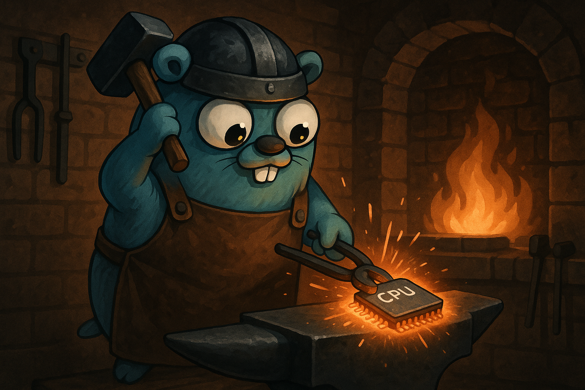

# byteforge



Byteforge is a modular collection of handcrafted Go data structures, concurrency utilities, and functional helpers. Built for speed, safety, and scalability.

---

## Features

### Collection

- [X] Map
- [X] Filter
- [X] Reduce

### Data Types

- [X] Ring Buffer 
- [X] FIFO Queue
- [X] Set
- [X] Tuple
- [ ] Stack
- [ ] Deque
- [ ] Priority Queue

### Utility Functions

#### Slices

- [X] Shallow Equals (slices.ShallowEquals)
- [X] Deep Equals (slices.DeepEquals)
- [X] Inclusive Range (slices.IRange)
- [X] Exclusive Range (slices.ERange)
- [X] Map (slices.Map)
- [X] Filter (slices.Filter)
- [ ] Reduce
- [X] Parallel Map (slices.ParallelMap)
- [X] Parallel Filter (slices.ParallelFilter)
- [ ] Parallel Reduce
- [ ] Partition
- [ ] Chunk
- [ ] Unique
- [ ] Flatten

#### Maps

- [ ] Map
- [ ] Filter
- [ ] Parallel Map
- [ ] Parallel Filter

(It's not an exhaustive list, it's just what came to my mind up until now. More will be added as they are required or provided)

---

## Testing

All components come with comprehensive unit tests. Thread-safe variants include specific concurrency tests to ensure correct behavior under parallel access patterns.

To run the tests and get coverage:

```bash
make test
```

--- 

## Getting Started

Install using ```go get```:

```bash
go get -u "github.com/PsionicAlch/byteforge@latest"
```

### Collection

Collection provides a fluent, chainable API for performing functional-style operations like map, filter, and reduce on slices.

<details>
<summary><strong>Collection</strong></summary>

Collection is roughly based off Laravel's [Collections](https://laravel.com/docs/12.x/collections) package. It's not as feature rich, so feel free to make any feature requests or send a pull request if you want to get your hands dirty. 

Honestly, I would **not** suggest using Collection in production yet.  
Because of the current [lack of generics for methods](https://github.com/golang/go/issues/49085), I had to use a lot of `any` and `reflect`.  
The code **looks pretty** when you chain a bunch of method calls together, and you can paint a really nice picture of how the data mutates over time —  
but I'd recommend sticking with [byteforge/functions/slices](#slices-map) instead.

You won't get the pretty chainability or the smooth data flow, and you'll need intermediate variables,  
but you'll get **much better performance**, **full type safety** and **full IntelliSense support**.

```go
import (
    "fmt"
    "strconv"

    "github.com/PsionicAlch/byteforge/collection"
    "github.com/PsionicAlch/byteforge/functions/slices"
)

func main() {
    s := []int{1, 2, 3, 4, 5, 6, 7, 8, 9, 10}

    // Step 1: Create a new collection.
    // FromSlice takes your input slice and wraps it in a Collection.
    // Internally, Collection stores data as 'any' because Go doesn't support
    // generic methods yet, so this sacrifices some type safety for flexibility.
    c := collection.FromSlice(s)

    // Step 2: Map over all elements.
    // Map takes a function that accepts one element (same type as the slice)
    // and returns one transformed element — which can be a **different** type.
    squared := c.Map(func(e int) int {
        return e * e
    })

    // You can also change the type, e.g., convert numbers to strings:
    asStrings := c.Map(func(e int) string {
        return strconv.Itoa(e)
    })

    // Step 3: Filter elements.
    // Filter takes a function that receives one element and returns a bool.
    // If the function returns true, the element stays; if false, it’s excluded.
    evens := c.Filter(func(e int) bool {
        return e % 2 == 0
    })

    // Step 4: ForEach side-effects.
    // ForEach lets you perform an action on each element **without** changing the 
    // data. The function must accept one element and return nothing.
    c.ForEach(func(e int) {
        fmt.Printf("Value: %d\n", e)
    })

    // Step 5: Reduce to a single value.
    // Reduce combines the elements into a single accumulated value.
    sum, err := c.Reduce(func(acc, e int) int {
        return acc + e
    }, 0)

    // If there were any issues with the functions you passed in the chain this
    // error will tell you about it.
    if err == nil {
        fmt.Println("Sum:", sum)
    }

    // Step 6: Extract the final slice.
    // ToSlice returns the processed slice as 'any' plus any accumulated error.
    result, err := c.ToSlice()

    // If there were any issues with the functions you passed in the chain this
    // error will tell you about it.
    if err == nil {
        fmt.Printf("Final slice: %#v\n", result)
    }

    // Optional: Convert to a typed slice.
    // Use the standalone generic function to cast safely.
    typed, err := collection.ToTypedSlice[int, []int](c)

    // If there were any issues with the functions you passed in the chain this
    // error will tell you about it.
    if err == nil {
        fmt.Printf("Typed slice: %#v\n", typed)
    }

    collection.
        FromSlice(slices.IRange(1, 100)).
        Filter(func (i int) bool {
            return i % 2 ==0
        }).
        Map(func (i int) string {
            return strconv.Itoa(i)
        }).
        ForEach(func (s string) {
            fmt.Printf("Value: %s\n", s)
        })
}
```
</details>

### Data Structures

All data structures come with a basic version and a thread-safe version. The thread-safe version is usually prefixed with "Sync" but the underlying API is the same and allow you to freely convert between the basic and thread-safe versions.

<details>
<summary><strong>Ring Buffer</strong></summary>

Ring Buffer is a generic dynamically resizable circular buffer. It supports enqueue and dequeue operations in constant amortized time, and grows or shrinks based on usage to optimize memory consumption.

```go
import "github.com/PsionicAlch/byteforge/datastructs/buffers/ring"

func main() {
    // To create a new ring buffer you can call the New
    // function with the type you want to store and an optional
    // initial capacity for performance sake. If no capacity is
    // provided it will default to 8.
    buf := ring.New[int]()

    // Or if you already have a slice of elements you can
    // construct a new ring buffer using the slice.
    buf = ring.FromSlice([]int{0, 1, 2, 3, 4, 5})

    // You can get the number of items in the buffer with the
    // Len method.
    fmt.Printf("Num of elements in buf: %d\n", buf.Len())

    // You can get the capacity of the buffer using the Cap
    // method.
    fmt.Printf("Capacity of the buffer: %d\n", buf.Cap())

    // You can check if the buffer is empty using the IsEmpty
    // method.
    fmt.Printf("Buffer is empty: %t\n", buf.IsEmpty())

    // You can add values to the back of the buffer using the
    // Enqueue method. It takes a variable amount of elements. 
    // The underlying buffer will grow to fit the data so you
    // don't need to manually check the size and capacity.
    buf.Enqueue(6, 7, 8, 9, 10)

    // You can remove values from the front of the buffer using
    // the Dequeue method. It returns a value and boolean to
    // indicate whether the value returned is actually valid.
    // If the boolean returned is false then the value will just
    // be a 0 value of whatever the underlying type is. A value
    // will be invalid if the buffer is empty.
    element, found := buf.Dequeue()

    // If you want to see what the value of the next element in
    // the buffer is without actually removing it from the buffer
    // you can use Peek method. Peek will return the value as well 
    // as a boolean indicating whether or not the value is valid. 
    // A value will be invalid if the buffer is empty.
    element, found = buf.Peek()

    // If you want to extract the values in the buffer to a 
    // slice it's as easy as calling the ToSlice method. It will
    // return a new slice that is completely disconnected from
    // the underlying buffer so you don't have to worry about
    // mutating the buffer by interacting with the new slice.
    s := buf.ToSlice()

    // You can get a fresh copy of the buffer by calling the 
    // Clone method. This will create a deep clone of the underlying
    // buffer. So you don't need to worry about mutating the 
    // original buffer by interacting with the new buffer.
    clone := buf.Clone()
}
```

The basic version of Ring Buffer isn't thread-safe so I wouldn't suggest sharing it between threads without the use of a mutex. If, however, you're not in the mood to manage your own mutexes I got you covered. I made sure to create a thread-safe version of Ring Buffer called Sync Ring Buffer. It's not as optimised as it can be because I just wrapped the basic version with a RWMutex instead of using atomic operations for things like managing the size and capacity but everything works just fine. You shouldn't really notice the difference in performance. The API for Sync Ring Buffer is also the same as the basic Ring Buffer.

```go
import "github.com/PsionicAlch/byteforge/datastructs/buffers/ring"

func main() {
    // To create a new sync ring buffer you can call the NewSync
    // function with the type you want to store and an optional
    // initial capacity for performance sake. If no capacity is
    // provided it will default to 8.
    buf := ring.NewSync[int]()

    // Or if you already have a slice of elements you can
    // construct a new sync ring buffer using the slice.
    buf = ring.SyncFromSlice([]int{0, 1, 2, 3, 4, 5})

    // You can get the number of items in the buffer with the
    // Len method.
    fmt.Printf("Num of elements in buf: %d\n", buf.Len())

    // You can get the capacity of the buffer using the Cap
    // method.
    fmt.Printf("Capacity of the buffer: %d\n", buf.Cap())

    // You can check if the buffer is empty using the IsEmpty
    // method.
    fmt.Printf("Buffer is empty: %t\n", buf.IsEmpty())

    // You can add values to the back of the buffer using the
    // Enqueue method. It takes a variable amount of elements. 
    // The underlying buffer will grow to fit the data so you
    // don't need to manually check the size and capacity.
    buf.Enqueue(6, 7, 8, 9, 10)

    // You can remove values from the front of the buffer using
    // the Dequeue method. It returns a value and boolean to
    // indicate whether the value returned is actually valid.
    // If the boolean returned is false then the value will just
    // be a 0 value of whatever the underlying type is. A value
    // will be invalid if the buffer is empty.
    element, found := buf.Dequeue()

    // If you want to see what the value of the next element in
    // the buffer is without actually removing it from the buffer
    // you can use Peek method. Peek will return the value as well 
    // as a boolean indicating whether or not the value is valid. 
    // A value will be invalid if the buffer is empty.
    element, found = buf.Peek()

    // If you want to extract the values in the buffer to a 
    // slice it's as easy as calling the ToSlice method. It will
    // return a new slice that is completely disconnected from
    // the underlying buffer so you don't have to worry about
    // mutating the buffer by interacting with the new slice.
    s := buf.ToSlice()

    // You can get a fresh copy of the buffer by calling the 
    // Clone method. This will create a deep clone of the underlying
    // buffer. So you don't need to worry about mutating the 
    // original buffer by interacting with the new buffer.
    clone := buf.Clone()
}
```

You can also easily convert between the basic and sync versions of Ring Buffer. Although keep in mind that each conversion will result in a deep clone being produced so it's not the fastest operating in the world but at least it's safe.

```go
import "slices"

import "github.com/PsionicAlch/byteforge/datastructs/buffers/ring"

func main() {
    orig := ring.FromSlice([]int{0, 1, 1, 2, 3, 5, 8, 13, 21, 34, 55})
    
    // You can convert a basic ring buffer to a sync ring buffer 
    // by calling SyncFromRingBuffer.
    syncBuf := ring.SyncFromRingBuffer(orig)

    // You can convert a sync ring buffer to a basic ring buffer 
    // by calling FromSyncRingBuffer.
    basicBuf := ring.FromSyncRingBuffer(syncBuf)

    // The conversions don't impact the order of the underlying buffer.
    match := slices.Equal(syncBuf.ToSlice(), basicBuf.ToSlice())
    fmt.Printf("Buffers match: %t\n", match)
}
```
</details>

<details>
<summary><strong>FIFO Queue (First In, First Out Queue)</strong></summary>

Queue is a generic dynamically resizable FIFO Queue. It supports enqueue and dequeue operations in constant amortized time, and grows or shrinks based on usage to optimize memory consumption.

```go
import "github.com/PsionicAlch/byteforge/datastructs/queue"

func main() {
    // To create a new queue you can call the New function 
    // with the type you want to store and an optional initial 
    // capacity for performance sake. If no capacity is provided 
    // it will default to 8.
    q := queue.New[int]()

    // Or if you already have a slice of elements you can
    // construct a new queue using the slice.
    q = queue.FromSlice([]int{0, 1, 2, 3, 4, 5})

    // You can get the number of items in the queue with the
    // Len method.
    fmt.Printf("Num of elements in buf: %d\n", q.Len())

    // You can get the capacity of the queue using the Cap
    // method.
    fmt.Printf("Capacity of the buffer: %d\n", q.Cap())

    // You can check if the queue is empty using the IsEmpty
    // method.
    fmt.Printf("Buffer is empty: %t\n", q.IsEmpty())

    // You can add values to the back of the queue using the
    // Enqueue method. It takes a variable amount of elements. 
    // The underlying buffer will grow to fit the data so you
    // don't need to manually check the size and capacity.
    q.Enqueue(6, 7, 8, 9, 10)

    // You can remove values from the front of the queue using
    // the Dequeue method. It returns a value and boolean to
    // indicate whether the value returned is actually valid.
    // If the boolean returned is false then the value will just
    // be a 0 value of whatever the underlying type is. A value
    // will be invalid if the buffer is empty.
    element, found := q.Dequeue()

    // If you want to see what the value of the next element in
    // the queue is without actually removing it from the queue
    // you can use Peek method. Peek will return the value as 
    // well as a boolean indicating whether or not the value is 
    // valid. A value will be invalid if the buffer is empty.
    element, found = q.Peek()

    // If you want to extract the values in the queue to a 
    // slice it's as easy as calling the ToSlice method. It will
    // return a new slice that is completely disconnected from
    // the underlying buffer so you don't have to worry about
    // mutating the queue by interacting with the new slice.
    s := q.ToSlice()

    // You can get a fresh copy of the queue by calling the 
    // Clone method. Clone will create a deep clone of the 
    // underlying buffer. So you don't need to worry about 
    // mutating the original queue by interacting with the 
    // new queue.
    clone := q.Clone()

    // You can compare two queues to see if they are equal to
    // one another. Two queues are equal if their underlying
    // slices are equal according to slices.Equal.
    equal := q.Equals(clone)
    fmt.Printf("Queue equals clone: %t\n", equal)
}
```

The basic version of Queue isn't thread-safe so I wouldn't suggest sharing it between threads without the use of a mutex. If, however, you're not in the mood to manage your own mutexes I got you covered. I made sure to create a thread-safe version of Queue called Sync Queue. It's not as optimised as it can be because I just wrapped the basic version with a RWMutex instead of using atomic operations for things like managing the size and capacity but everything works just fine. You shouldn't really notice the difference in performance. The API for Sync Queue is also the same as the basic Queue.

```go
import "github.com/PsionicAlch/byteforge/datastructs/queue"

func main() {
    // To create a new sync queue you can call the NewSync
    // function with the type you want to store and an optional
    // initial capacity for performance sake. If no capacity is
    // provided it will default to 8.
    q := queue.NewSync[int]()

    // Or if you already have a slice of elements you can
    // construct a new sync queue using the slice.
    q = queue.SyncFromSlice([]int{0, 1, 2, 3, 4, 5})

    // You can get the number of items in the queue with the
    // Len method.
    fmt.Printf("Num of elements in buf: %d\n", q.Len())

    // You can get the capacity of the queue using the Cap
    // method.
    fmt.Printf("Capacity of the buffer: %d\n", q.Cap())

    // You can check if the queue is empty using the IsEmpty
    // method.
    fmt.Printf("Buffer is empty: %t\n", q.IsEmpty())

    // You can add values to the back of the queue using the
    // Enqueue method. It takes a variable amount of elements. 
    // The underlying buffer will grow to fit the data so you
    // don't need to manually check the size and capacity.
    q.Enqueue(6, 7, 8, 9, 10)

    // You can remove values from the front of the queue using
    // the Dequeue method. It returns a value and boolean to
    // indicate whether the value returned is actually valid.
    // If the boolean returned is false then the value will just
    // be a 0 value of whatever the underlying type is. A value
    // will be invalid if the buffer is empty.
    element, found := q.Dequeue()

    // If you want to see what the value of the next element in
    // the queue is without actually removing it from the queue
    // you can use Peek method. Peek will return the value as well 
    // as a boolean indicating whether or not the value is valid. 
    // A value will be invalid if the buffer is empty.
    element, found = q.Peek()

    // If you want to extract the values in the queue to a 
    // slice it's as easy as calling the ToSlice method. It will
    // return a new slice that is completely disconnected from
    // the underlying buffer so you don't have to worry about
    // mutating the queue by interacting with the new slice.
    s := q.ToSlice()

    // You can get a fresh copy of the queue by calling the 
    // Clone method. This will create a deep clone of the underlying
    // buffer. So you don't need to worry about mutating the 
    // original queue by interacting with the new queue.
    clone := q.Clone()

    // You can compare two queues to see if they are equal to
    // one another. Two queues are equal if their underlying
    // slices are equal according to slices.Equal.
    equal := q.Equals(clone)
    fmt.Printf("Queue equals clone: %t\n", equal)
}
```

You can also easily convert between the basic and sync versions of Queue. Although keep in mind that each conversion will result in a deep clone being produced so it's not the fastest operating in the world but at least it's safe.

```go
import "slices"

import "github.com/PsionicAlch/byteforge/datastructs/queue"

func main() {
    orig := queue.FromSlice([]int{0, 1, 1, 2, 3, 5, 8, 13, 21, 34, 55})
    
    // You can convert a basic queue to a sync queue by calling 
    // SyncFromRingBuffer.
    syncQ := queue.SyncFromRingBuffer(orig)

    // You can convert a sync queue to a basic queue by calling 
    // FromSyncRingBuffer.
    basicQ := queue.FromSyncRingBuffer(syncQ)

    // The conversions don't impact the order of the underlying buffer.
    match := slices.Equal(syncQ.ToSlice(), basicQ.ToSlice())
    fmt.Printf("Queues match: %t\n", match)
}
```
</details>

<details>
<summary><strong>Set</strong></summary>

🚧 Documentation is currently under construction 🚧
</details>

<details>
<summary><strong>Tuple</strong></summary>

🚧 Documentation is currently under construction 🚧
</details>

### Utility Functions

<details>
<summary><strong>slices.ShallowEquals</strong></summary>

Shallow Equals checks if two slices are equal to one another by checking if they have the same amount of elements and whether or not all the elements found in the first slice could also be found in the second slice. Shallow Equals does not care about the order of the elements. Both slices need to be of the same type.

```go
import (
    "fmt"

    "github.com/PsionicAlch/byteforge/functions/slices"
)

func main() {
    s1 := []int{1, 2, 3, 4, 5, 6, 7, 8, 9, 10}
    s2 := []int{2, 3, 6, 5, 8, 9, 10, 1, 4, 7}

    if slices.ShallowEquals(s1, s2) {
        fmt.Println("Slices are equal")
    }

    s3 := []int{0, 1, 2, 3, 4, 5, 6, 7, 8, 9}

    if !slices.ShallowEquals(s1, s3) {
        fmt.Println("Slices are not equal")
    }
}
```
</details>

<details>
<summary><strong>slices.DeepEquals</strong></summary>

Deep Equals is simply a wrapper around slices.Equal from the standard library. It's here for the sake of completeness. As such here is the description for slices.Equal from the standard library: `Equal reports whether two slices are equal: the same length and all elements equal. If the lengths are different, Equal returns false. Otherwise, the elements are compared in increasing index order, and the comparison stops at the first unequal pair. Empty and nil slices are considered equal. Floating point NaNs are not considered equal.`

```go
import (
    "fmt"

    "github.com/PsionicAlch/byteforge/functions/slices"
)

func main() {
    s1 := []int{1, 2, 3, 4, 5, 6, 7, 8, 9, 10}
    s2 := []int{1, 2, 3, 4, 5, 6, 7, 8, 9, 10}

    if slices.DeepEquals(s1, s2) {
        fmt.Println("Slices are equal")
    }

    s3 := []int{2, 3, 6, 5, 8, 9, 10, 1, 4, 7}

    if !slices.DeepEquals(s1, s3) {
        fmt.Println("Slices are not equal")
    }
}
```
</details>

<details>
<summary><strong>slices.IRange</strong></summary>

IRange creates a range from min to max. The range is inclusive. You can change the step size by passing a step, otherwise it will default to +/- 1 of the type you want your range slice to be. If min is greater than max then the function assumes you're counting backwards and so the step size would default to -1. If max is greater than min then the function will default to using a +1 as it's step size. If you provide a step size that would result in an infinite loop the function will return an empty slice.

```go
import (
    "fmt"

    "github.com/PsionicAlch/byteforge/functions/slices"
)

func main() {
    s1 := slices.IRange(1, 10)
    s2 := []int{1, 2, 3, 4, 5, 6, 7, 8, 9, 10}

    if slices.DeepEquals(s1, s2) {
        fmt.Println("Slices are equal")
    }

    s3 := slices.IRange(0, 10, 2)
    s4 := []int{0, 2, 4, 6, 8, 10}

    if slices.DeepEquals(s1, s2) {
        fmt.Println("Slices are equal")
    }
}
```
</details>

<details>
<summary><strong>slices.ERange</strong></summary>

ERange creates a range from min to max. The range is exclusive. You can change the step size by passing a step, otherwise it will default to +/- 1 of the type you want your range slice to be. If min is greater than max then the function assumes you're counting backwards and so the step size would default to -1. If max is greater than min then the function will default to using a +1 as it's step size. If you provide a step size that would result in an infinite loop the function will return an empty slice.

```go
import (
    "fmt"

    "github.com/PsionicAlch/byteforge/functions/slices"
)

func main() {
    s1 := slices.ERange(1, 10)
    s2 := []int{1, 2, 3, 4, 5, 6, 7, 8, 9}

    if slices.DeepEquals(s1, s2) {
        fmt.Println("Slices are equal")
    }

    s3 := slices.ERange(0, 10, 2)
    s4 := []int{0, 2, 4, 6, 8}

    if slices.DeepEquals(s1, s2) {
        fmt.Println("Slices are equal")
    }
}
```
</details>

<details id="slices-map">
<summary><strong>slices.Map</strong></summary>

Map applies the output of a given function to each element of the input slice returning a new slice containing the results.

```go
import (
    "fmt"
    "strconv"

    "github.com/PsionicAlch/byteforge/functions/slices"
)

func main() {
    s1 := []int{1, 2, 3, 4, 5, 6, 7, 8, 9, 10}
    s2 := slices.Map(s1, func (i int) int) {
        return i * 2
    }
    s3 := []int{2, 4, 6, 8, 10, 12, 14, 16, 18, 20}

    if slices.DeepEquals(s2, s3) {
        fmt.Println("Slices are equal")
    }

    // The new slice can be of any type you want. You aren't limited to using the 
    // same type as the input slice.
    s4 := slices.Map(s1, func (i int) string {
        return strconv.Itoa(i)
    })
    s5 := []string{"1", "2", "3", "4", "5", "6", "7", "8", "9", "10"}

    if slices.DeepEquals(s4, s5) {
        fmt.Println("Slices are equal")
    }
}
```
</details>

<details>
<summary><strong>slices.Filter</strong></summary>

Filter returns a new slice containing only the elements of the input slice for which the predicate function returns true. The original order of elements is preserved. The output slice is a newly allocated slice of the same type as the input.

```go
import (
    "fmt"

    "github.com/PsionicAlch/byteforge/functions/slices"
)

func main() {
    s1 := []int{1, 2, 3, 4, 5, 6, 7, 8, 9, 10}
    s2 := slices.Filter(s1, func (i int) bool {
        return i % 2 == 0
    })
    s3 := []int{2, 4, 6, 8, 10}

    if slices.DeepEquals(s2, s3) {
        fmt.Println("Slices are equal")
    }
}
```
</details>

<details>
<summary><strong>slices.ParallelMap</strong></summary>

Parallel Map applies the function to each element of the input slice concurrently using a worker pool, and returns a new slice containing the results in the original order.

The number of concurrent workers can be controlled via the optional workers parameter. If omitted or set to a non-positive number, the number of logical CPUs (`runtime.GOMAXPROCS(0)`) is used by default.

Keep in mind that there is an overhead cost involved in handling the worker pool. The benefit of Parallel Map only starts to show once the size of the slice is much larger.

```go
import (
    "fmt"

    "github.com/PsionicAlch/byteforge/functions/slices"
)

func main() {
    s1 := []int{1, 2, 3, 4, 5, 6, 7, 8, 9, 10}
    s2 := slices.ParallelMap(s1, func (i int) int) {
        return i * 2
    }
    s3 := []int{2, 4, 6, 8, 10, 12, 14, 16, 18, 20}

    if slices.DeepEquals(s2, s3) {
        fmt.Println("Slices are equal")
    }

    // You can easily set the number of workers in the pool.
    s4 := slices.ParallelMap(s1, func (i int) int {
        return i * 2
    }, 52)

    if slices.DeepEquals(s4, s3) {
        fmt.Println("Slices are equal")
    }
}
```
</details>

<details>
<summary><strong>slices.ParallelFilter</strong></summary>

🚧 Documentation is currently under construction 🚧
</details>

---

## Contributing

Contributions, feature requests, and bug reports are welcome! Please open an issue or submit a PR.

---

## License

This project is licensed under the MIT License. See [LICENSE](./LICENSE) for details.

---

## Author

[Jean-Jacques Strydom](https://github.com/PsionicAlch)